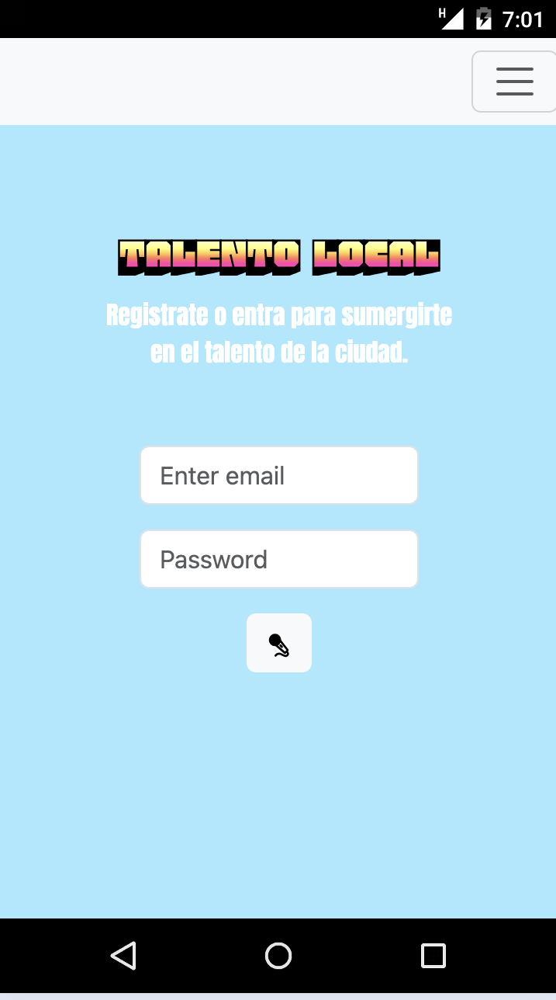
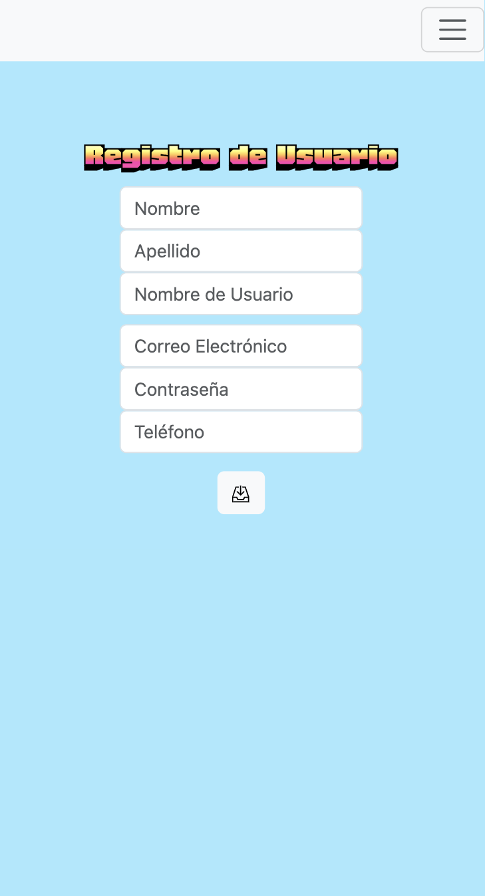
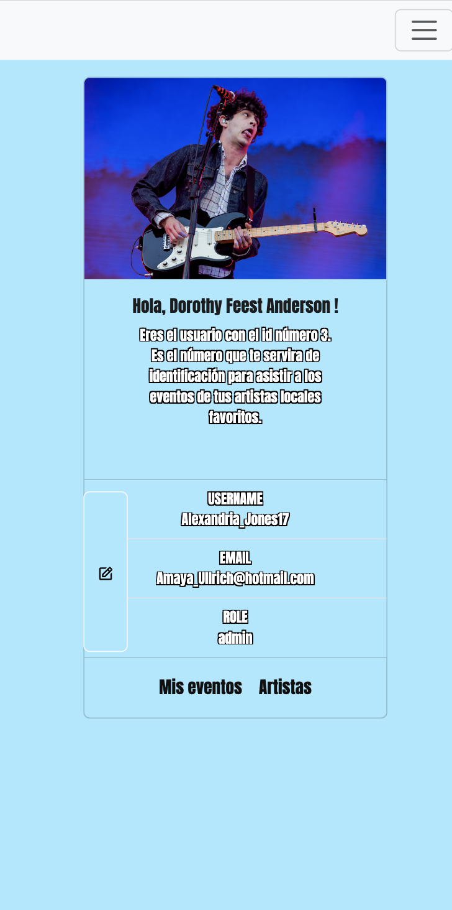
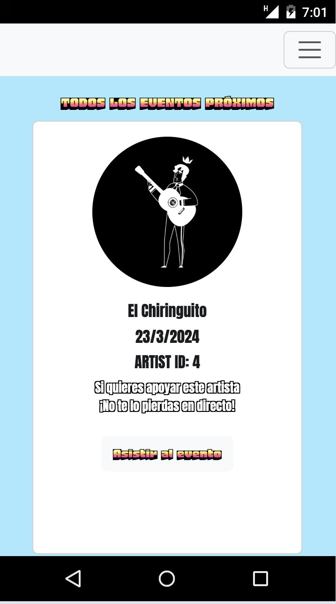
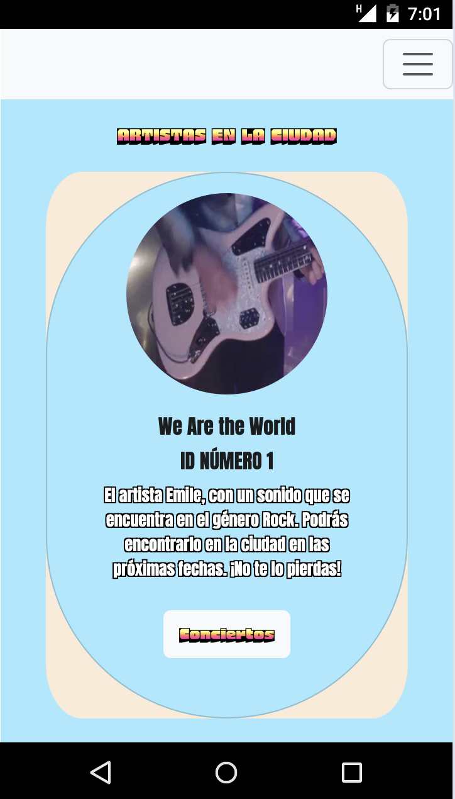
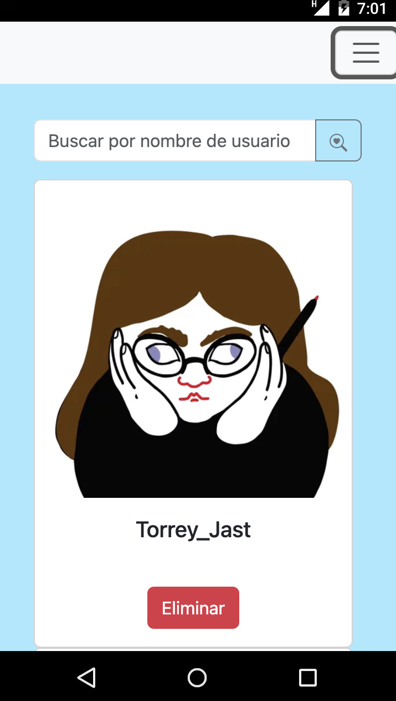
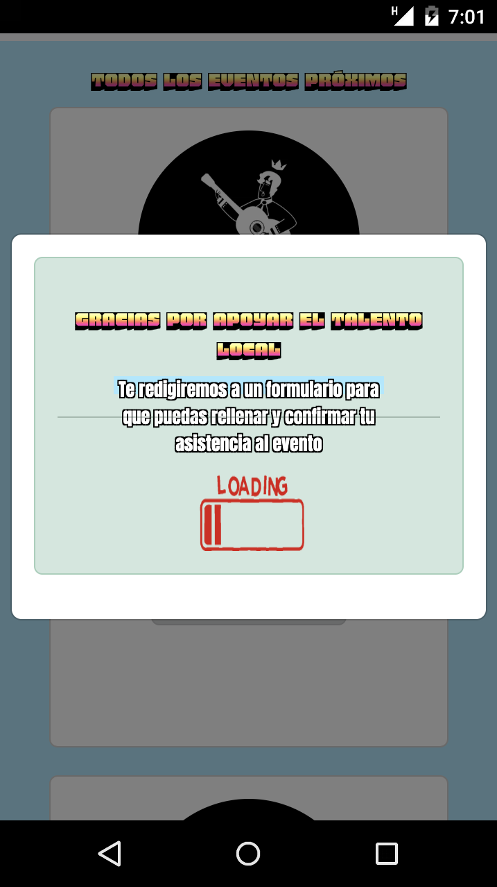
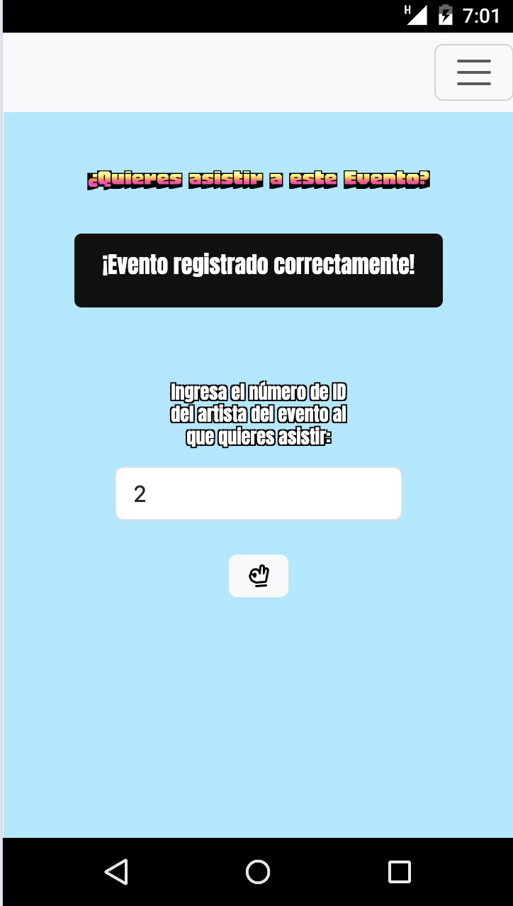

# Welcome to my second frontend app with React. 

<details>
  <summary>Contenido 📝</summary>
  <ol>
    <li><a href="#objetivo-🎯">Objetivo</a></li>
    <li><a href="#sobre-el-proyecto-🔎">Sobre el proyecto</a></li>
    <li><a href="#stack">Stack</a></li>
    <li><a href="#instalación-en-local">Instalación</a></li>
    <li><a href="#vistas">Vistas</a></li>
    <li><a href="#futuras-funcionalidades">Futuras funcionalidades</a></li>
    <li>
    <li><a href="#desarrollo">Desarrollo</a></li>
    <li><a href="#agradecimientos">Agradecimientos</a></li>
    <li><a href="#contacto">Contacto</a></li>
  </ol>
</details>

## Objetivo 🎯
Este proyecto requería conexión a la API funcional creada anterriormente para el proyecto de backend de la app de músicos locales. 
Con react decidí crear el frontend para darle diseño y funcionalidad a la aplicación.

## Sobre el proyecto 🔎
Decidí crear una aplicación web para ayudar a los artistas locales a tener un punto de encuentro eficaz y sencillo con los apasionados de la música de la ciudad. Los artistas subirán sus eventos más próximos y los usuarios registrados podrán ver de qué artistas se trata y cualés son los eventos que hay, dónde y en qué fecha. 
Podrán suscribirse a los eventos a traves de un formulario para hacer saber a los artistas de su asistencia a estos y apoyar el talento de la escena local de una forma directa, dinámica y eficaz.

## Stack
<div align="center">
<a href="https://www.reactjs.com/">
    
</a>
<a href="https://developer.mozilla.org/es/docs/Web/JavaScript">
    
</a>

<a href="">
    
</a>


 </div>

## Instalación en local
1. Clonar el repositorio
2. ` $ npm install `
3. ``` $ npm run dev ```
4. ...

## Vistas
------------------
                HOME/LOGIN
                            
 

                REGISTRO
                            
 

              PERFIL
                            
 
              
              EVENTOS
                            
 

           ARTISTAS
                            
 


            ADMIN
                            
 

            MIS EVENTOS
                            
 
 
       
    ASISTENCIA EVENTO
                            
 


## Contribuciones
Las sugerencias y aportaciones son siempre bienvenidas.  

Puedes hacerlo de dos maneras:

1. Abriendo una issue
2. Crea un fork del repositorio
    - Crea una nueva rama  
        ```
        $ git checkout -b feature/nombreUsuario-mejora
        ```
    - Haz un commit con tus cambios 
        ```
        $ git commit -m 'feat: mejora X cosa'
        ```
    - Haz push a la rama 
        ```
        $ git push origin feature/nombreUsuario-mejora
        ```
    - Abre una solicitud de Pull Request


## Desarrollo:

``` js
 const developer = "María Lázaro";

 console.log("Desarrollado por: " + developer);
```  

## Agradecimientos:

Agradezco a mis profesor Demian por las dudas resueltas y a todos mis compañeros.

-  **Hector**  
  <a href="https://github.com/HSoriano99?tab=followers" target="_blank"></a>

- **Gabe**  
  <a href="https://github.com/GabrielEscudillo" target="_blank"></a>

  


## Contacto

<a href = "mailto:marialazaro.code@gmail.com"></a>
<a href="https://www.linkedin.com/in/linkedinUser/" target="_blank"></a> 
</p>